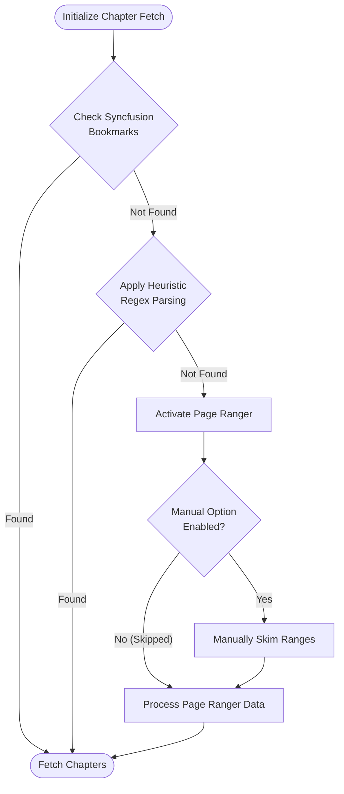

### Chapter Reader 
- This part briefly dictates how the chapter picking operates 

## Mermaid Flowchart

## Brief Explanation
- The Chapter Reader operates on a tiered, fail-safe hierarchy that prioritizes speed and automation first, 
- before falling back to manual user intervention.
1. Automated Structure Verification 
    * **Syncfusion Bookmarks** : The system instantly checks the book file's structural metadata upon opening. If native document bookmarks exist, it extracts the chapters immediately, bypassing all other logic.
2.  Heuristic Regex Parsing
    * **Pattern Matching** : If bookmarks are missing, the system scans the raw text using heuristic regular expressions. It dynamically looks for common structural patterns (e.g., "*Chapter X*", "*Section Y*", or Roman numerals) to automatically reconstruct the table of contents.
3. Page Ranger & Optional Manual Skimming
    * **Page Ranger** : If both automated structural and text checks fail, the system falls back to a page-range-based segmentation tool.