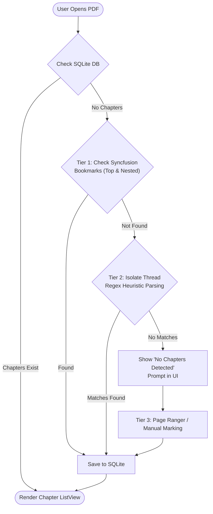

### Chapter Reader 
This document dictates the architecture, fallback hierarchy, and UI specifications for the chapter parsing and rendering engine.

## Architectural Flowchart

```mermaid
flowchart TD
    Start([User Opens PDF]) --> CheckDB{Check SQLite DB}
    
    %% Database Path
    CheckDB -- Chapters Exist --> RenderUI([Render Chapter ListView])
    
    %% Tier 1: Automated Syncfusion Bookmarks
    CheckDB -- No Chapters --> Tier1{"Tier 1: Check Syncfusion\nBookmarks (Top & Nested)"}
    Tier1 -- Found --> SaveDB[Save to SQLite]
    
    %% Tier 2: Heuristic Regex Parsing (Background Isolate)
    Tier1 -- Not Found --> Tier2{"Tier 2: Isolate Thread\nRegex Heuristic Parsing"}
    Tier2 -- Matches Found --> SaveDB
    
    %% Tier 3: Manual Page Ranger
    Tier2 -- No Matches --> FallbackUI["Show 'No Chapters Detected'\nPrompt in UI"]
    FallbackUI --> Tier3[Tier 3: Page Ranger / Manual Marking]
    
    %% Save & Render
    Tier3 --> SaveDB
    SaveDB --> RenderUI
```

## The Three-Tier Hierarchy
The Chapter Reader operates on a fail-safe hierarchy prioritizing speed and automation, falling back to manual intervention only when necessary.

### 1. Automated Structure Verification (Tier 1)
- **Syncfusion Bookmarks**: The system instantly checks structural metadata. If native document bookmarks exist (both top-level and nested), it extracts them immediately and saves them to SQLite.

### 2. Heuristic Regex Parsing (Tier 2)
- **Background Isolate**: Because text extraction is expensive, this runs on a background thread.
- **Pattern Matching**: Scans raw text for common structural patterns (e.g., *Chapter X*, *Section Y*, Roman numerals) to automatically reconstruct the TOC and calculate start/end pages.

### 3. Page Ranger & Manual Skimming (Tier 3)
- **Manual UI**: If a PDF is entirely unstructured, the user sees "No Chapters Detected".
- **Page Ranger**: Users can manually define chapters by inputting page ranges (Start/End) or dropping markers while reading.

---

## UI Specifications: Chapter ListView

When chapters are successfully loaded into `BookDetailScreen`, they are rendered in a dynamic `ListView` with the following requirements:

1. **Chapter Details**: Each list item displays the Chapter Title, the Start Page, and the End Page.
2. **Dynamic Progress Bar**: A linear progress bar beneath the chapter title calculates the user's progress *specific to that chapter* (e.g., if a chapter spans pages 10-20, and the user is on page 15, the bar is 50% full).
3. **Completion Indicator**: Once the user's current page surpasses the chapter's End Page, the progress bar hits 100% and a trailing checkmark icon appears to denote completion.
