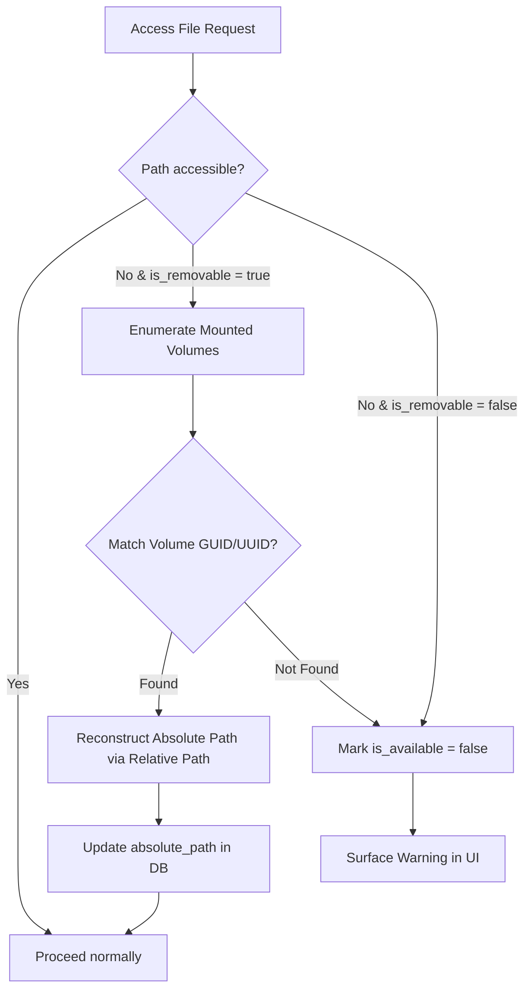
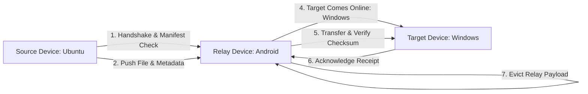
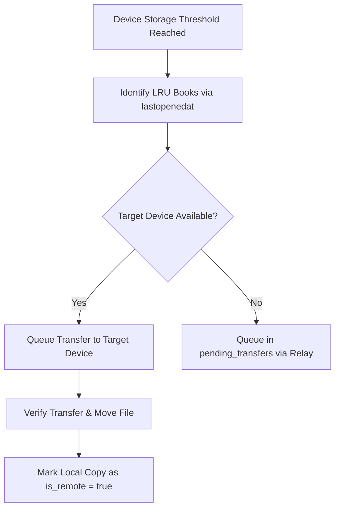
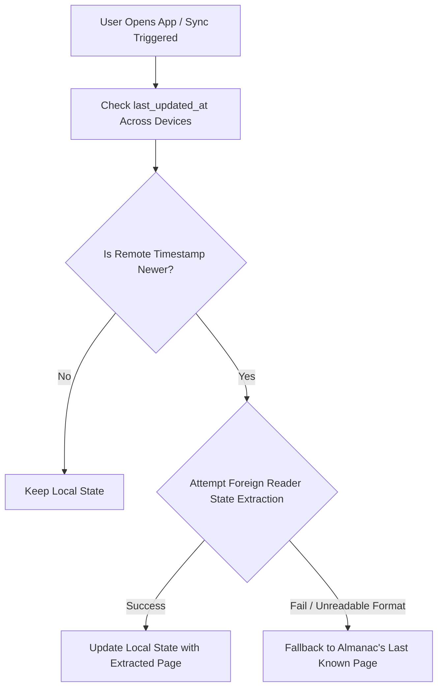

# Sync, Storage & Reading State Architecture

This document details the architectural processes for handling dynamic media mounts, background store-and-forward file transfers, tiered device storage offloading, and reading state reconciliation (VCS).

---

## 1. Dynamic Mount & Drive Letter Resolution

To prevent broken file paths when external drives change mount points (e.g. Windows drive letters `E:\` changing to `F:\`), the system uses volume-level identification rather than absolute path matching alone.

### Design Notes:
- **Identifier**: Hardware-bound Volume GUID (Windows `GetVolumeNameForVolumeMountPoint()`) or Volume UUID (`/dev/disk/by-uuid/` on Linux/macOS).
- **Fallback**: The `absolute_path` acts as a cached hint. The `volume_serial` + `relative_path` form the true identity.

---

## 2. Store-and-Forward Relay (Pending Transfers)

Devices with high availability (e.g. Android) serve as intermediaries when two target devices (e.g. dual-booted Ubuntu & Windows) cannot be online simultaneously.

### Design Notes:
- **Handshake First**: Checks file hashes (SHA-256) and metadata before transferring payload bytes to avoid duplicate transfers.
- **Silent Background Processing**: Transfers run quietly in the background without spamming notifications.
- **Relay Expiry**: Relay entries have an expiration timestamp (`relay_expires_at`) to prevent abandoned files from clogging relay storage indefinitely.

---

## 3. Tiered Storage & Cascading Offload

Devices enforce configurable storage thresholds. When a device reaches its capacity threshold, least-recently-opened books automatically offload down the storage chain.

### Design Notes:
- **LRU Policy**: Driven by `lastopenedat` on the `books` table.
- **Remote Book Stubs**: Offloaded books remain visible in the local library with `is_remote = true` and `remotedeviceid` pointing to the remote location.

---

## 4. Minimalist VCS for Reading State

A lightweight, last-write-wins reconciliation model for tracking reading progress and state across different devices and PDF readers.

### Design Notes:
- **Reconciliation**: Strictly based on timestamps (`last_updated_at`). The latest update wins.
- **Best-Effort Reader Adapters**: If foreign reader artifacts (e.g., Okular `.okr` sidecars) can be parsed, the progress is updated. If proprietary/unreadable (e.g., Adobe closed cache), it silently falls back to Almanac's last known page.
